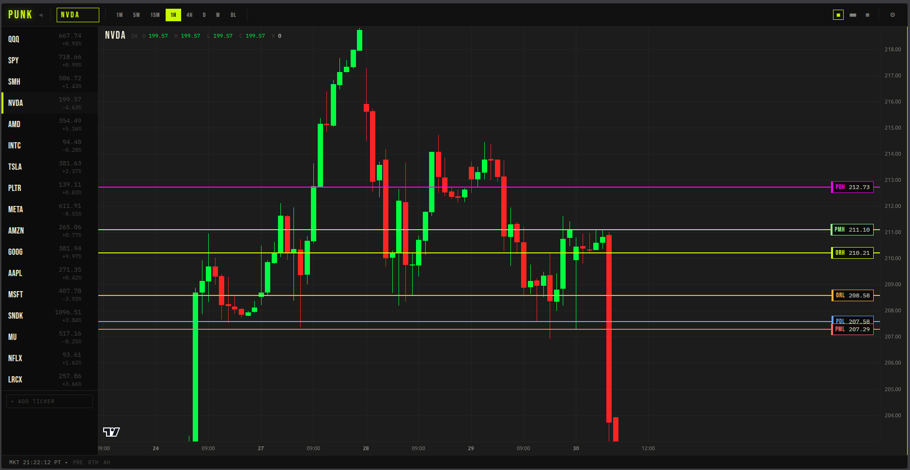

# PunkTrader

Stock charting terminal. Dark, brutal, fast. Candlestick charts with real-time price updates via 5s batch polling, key levels on the chart, multi-panel layouts, dynamic watchlist sidebar.



---

## Features

- **Real-time candles** — FMP `/batch-quote` polled every 5s, one request for all tickers, streamed via SSE
- **Key levels** — PDH/PDL (prior day), PMH/PML (prior month), ORH/ORL (opening range) as horizontal lines with labels
- **Multi-panel layouts** — 1x1, 1x2, 2x2 grids, each panel with independent ticker and timeframe
- **Session persistence** — all panel tickers/timeframes/layout saved to localStorage; restored on reopen
- **Watchlist sidebar** — live price ticks, color-coded change %, staleness indicator, add/remove tickers inline
- **Candle countdown timer** — MM:SS until next bar close, rendered on price scale
- **Alert engine** — fires once per level cross, tracked per (ticker, level) pair
- **Draw tool** — horizontal line drawing on charts
- **Session markers** — pre-market (orange) and after-hours (blue) zone backgrounds + vertical markers
- **Type-anywhere ticker entry** — just start typing a ticker symbol, it auto-focuses the input and registers on Enter. No clicking needed
- **Keyboard shortcuts** — `1`–`7` for timeframe, `Ctrl+K` / `/` to jump to ticker
- **Premarket bars** — `extended=true` pulls 04:00–09:29 ET bars from FMP intraday endpoints
- **Timeframes** — 1Min, 5Min, 15Min, 1Hour, 4Hour, 1Day, 1Week
- **Multi-instance** — `?i=N` query param isolates localStorage keys for multiple windows
- **Settings UI** — configure API key, timezone, defaults at `/settings`, written back to `.env`

---

## Quick Start

```bash
python -m venv venv && source venv/bin/activate
pip install -r requirements.txt
python app.py        # starts on http://localhost:5000
```

Get a free FMP API key at [financialmodelingprep.com](https://financialmodelingprep.com) and enter it at `/settings`.

Tests run automatically on start (or manually: `venv/bin/pytest`).

---

## Configuration

All config lives in `.env`. Can be edited directly or via `/settings`.

| Key | Default | Notes |
|-----|---------|-------|
| `FMP_API_KEY` | — | Required. Free tier works for basic use. |
| `FMP_BASE_URL` | `https://financialmodelingprep.com/stable` | FMP stable API base |
| `TIMEZONE` | `America/Los_Angeles` | Display timezone |
| `DEFAULT_TICKER` | `SPY` | Ticker shown on load |
| `DEFAULT_TIMEFRAME` | `5Min` | Bar timeframe on load |
| `WATCHLIST` | `SPY,QQQ,AAPL,...` | Comma-separated; drives sidebar and level pre-loading |

---

## Architecture

```
FMPBatchPoller (5s poll, all tickers, one request)
  → CandleBuilder (per-minute OHLCV buckets)
    → StreamState (SSE broadcast)
      → /stream/<ticker> (Server-Sent Events)
        → DataFeed.js (buckets into panel timeframe)
          → lightweight-charts (candleSeries.update)
```

Historical bars and levels load on ticker change via REST (`/api/bars`, `/api/levels`). Live updates stream on top. Level alerts fire on bar close if a level boundary is crossed.

---

## Tech Stack

- Python 3.12, Flask
- [lightweight-charts](https://github.com/tradingview/lightweight-charts) (TradingView)
- [Financial Modeling Prep API](https://financialmodelingprep.com) — free tier, no WebSocket required
- Punk Brutalist CSS — `#CFFF04` on black, Bebas Neue + IBM Plex Mono
- CSP security headers, input sanitization on all endpoints

---

## Known Limits

- FMP free tier has a 250 calls/day cap on some endpoints. Historical bar fetches consume quota; `/batch-quote` was not capped in testing.
- FMP WebSocket requires a $59/mo Premium plan — not used. Batch polling is the live data path.
- ETFs may be unavailable on certain FMP endpoints depending on plan tier.
